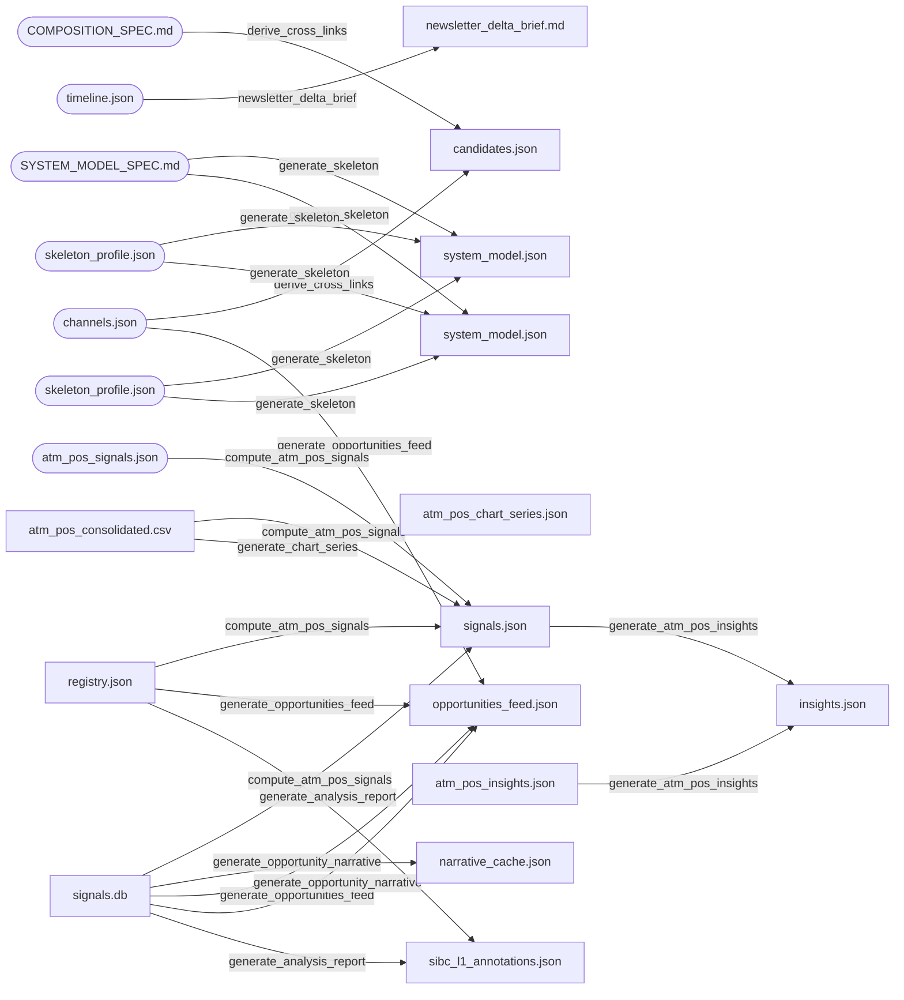

# Architecture (generated)

> ⚠ **GENERATED — do not edit by hand.** Source of truth is the code, via
> `analysis/architecture/discover.py`. Regenerate:
> ```
> python3 analysis/architecture/discover.py && python3 analysis/architecture/render.py
> ```
> Authored rationale (layer model, design principles, guard purposes) lives in the
> hand-written `ARCHITECTURE.md`. This file is the structural, drift-guarded half.

_Derived from 65 scripts._

## 1. Data-flow

Artifact dependency DAG — nodes are artifacts, each edge is the script that
transforms one into the next. Derived from read/write analysis of the code.



_Stadium nodes = external/authored inputs (no script writes them)._
_Edges are script-level: a script that reads A and writes B yields A→B, so a
script spanning both pipelines may show cross-pipeline edges. See §3 for the
exact per-artifact producer/consumer._

## 2. Gate call-graph

Scripts each orchestrator launches as a subprocess, in execution order.

### `run_evals` → 20 steps
1. `update_web_data`
2. `validate_timeline`
3. `validate_sections`
4. `validate_annotations`
5. `generate_skeleton`
6. `validate_system_model`
7. `validate_content`
8. `validate_claims`
9. `validate`
10. `validate_annotation_basis`
11. `validate_signal_history`
12. `check_signal_freshness`
13. `validate_sibc_traceability`
14. `generate_analysis_report`
15. `validate_web_series`
16. `generate_system_state`
17. `derive_opportunities`
18. `compose_ecosystem`
19. `generate_opportunities_feed`
20. `validate_opportunity_traceability`

### `run_atm_pos_evals` → 17 steps
1. `detect_atm_pos_format`
2. `extract_atm_pos`
3. `validate_atm_pos`
4. `consolidate_atm_pos`
5. `validate_signal_history`
6. `check_signal_freshness`
7. `generate_system_state`
8. `derive_opportunities`
9. `validate_opportunity_traceability`
10. `generate_skeleton`
11. `validate_system_model`
12. `compute_atm_pos_signals`
13. `generate_chart_series`
14. `generate_atm_pos_insights`
15. `validate_atm_pos_insights`
16. `validate_atm_pos_claims`
17. `generate_atm_pos_analysis_report`

### `check_derived_fresh` → 7 steps
1. `generate_skeleton`
2. `generate_system_state`
3. `derive_opportunities`
4. `compose_ecosystem`
5. `derive_cross_links`
6. `generate_opportunities_feed`
7. `generate_chart_series`

### `hook_validate` → 4 steps
1. `validate_annotations`
2. `validate`
3. `validate_timeline`
4. `validate_sections`

## 3. Artifact lineage

| Artifact | Kind | Producer(s) | Consumer(s) |
|---|---|---|---|
| `analysis/*/merged/system_state_*.json` | external/authored | — | `run_inference` |
| `analysis/COMPOSITION_SPEC.md` | external/authored | — | `derive_cross_links`, `migrate_forces_to_instances` |
| `analysis/SYSTEM_MODEL_SPEC.md` | external/authored | — | `generate_skeleton` |
| `analysis/cross_source/candidates.json` | derived | `derive_cross_links` | `check_derived_fresh`, `run_inference` |
| `analysis/cross_source/composition.json` | external/authored | — | `compose_ecosystem`, `run_inference`, `validate_composition` |
| `analysis/cross_source/ecosystem_state_*.json` | external/authored | — | `check_derived_fresh` |
| `analysis/newsletter/newsletter_config.json` | external/authored | — | `newsletter/generate_linkedin`, `newsletter/generate_newsletter`, `newsletter/validate_newsletter_config` |
| `analysis/newsletter/newsletter_delta_brief.md` | derived | `newsletter/newsletter_delta_brief` | — |
| `analysis/ontology/channels.json` | external/authored | — | `derive_cross_links`, `generate_opportunities_feed`, `migrate_forces_to_instances`, `run_inference`, `validate_system_model` |
| `analysis/ontology/concepts.json` | external/authored | — | `validate_system_model` |
| `analysis/rbi_atm_pos/insights.json` | derived | `generate_atm_pos_insights` | `validate_atm_pos_claims`, `validate_atm_pos_insights` |
| `analysis/rbi_atm_pos/merged/opportunities_*.json` | external/authored | — | `check_derived_fresh` |
| `analysis/rbi_atm_pos/merged/system_model.json` | derived | `generate_skeleton` | `check_derived_fresh` |
| `analysis/rbi_atm_pos/merged/system_state_*.json` | external/authored | — | `check_derived_fresh` |
| `analysis/rbi_atm_pos/signals.json` | derived | `compute_atm_pos_signals` | `generate_atm_pos_insights`, `validate_atm_pos_claims`, `validate_atm_pos_insights` |
| `analysis/rbi_atm_pos/skeleton_profile.json` | external/authored | — | `generate_skeleton` |
| `analysis/rbi_sibc/merged/annotations_merged.ts` | derived | `backfill_sibc_basis` | `validate_annotation_basis` |
| `analysis/rbi_sibc/merged/opportunities_*.json` | external/authored | — | `check_derived_fresh` |
| `analysis/rbi_sibc/merged/sections_merged.json` | external/authored | — | `detect_format`, `generate_merge`, `hook_validate`, `run_evals`, `validate_content`, `validate_web_series`, `newsletter/validate_newsletter_config` |
| `analysis/rbi_sibc/merged/subsystems.json` | external/authored | — | `generate_mermaid`, `run_evals` |
| `analysis/rbi_sibc/merged/system_model.json` | derived | `generate_skeleton` | `check_derived_fresh`, `run_evals`, `source_claims`, `validate_claims` |
| `analysis/rbi_sibc/merged/system_state_*.json` | external/authored | — | `check_derived_fresh` |
| `analysis/rbi_sibc/skeleton_profile.json` | external/authored | — | `generate_skeleton` |
| `analysis/rbi_sibc/timeline.json` | external/authored | — | `generate_merge`, `run_evals`, `validate_timeline`, `signals/query`, `newsletter/newsletter_delta_brief`, `signals/compute/sibc` |
| `analysis/signals/narrative_cache.json` | derived | `generate_opportunity_narrative` | — |
| `analysis/signals/registry.json` | derived | `signals/apply_status_rules`, `signals/rebuild_atm_pos_signals`, `signals/rebuild_sibc_signals`, `signals/update_registry` | `check_signal_freshness`, `compute_atm_pos_signals`, `generate_analysis_report`, `generate_opportunities_feed`, `generate_signal_history`, `validate_atm_pos_insights`, `validate_opportunity_traceability`, `validate_sibc_traceability`, `validate_signal_history` |
| `analysis/signals/signals.db` | derived | `signals/db` | `check_derived_fresh`, `compute_atm_pos_signals`, `derive_opportunities`, `generate_analysis_report`, `generate_opportunities_feed`, `generate_opportunity_narrative`, `generate_system_state`, `run_atm_pos_evals`, `run_evals`, `validate_atm_pos_insights`, `validate_opportunity_traceability`, `validate_sibc_traceability`, `validate_signal_history` |
| `web/lib/reports/rbi_sibc.ts` | derived | `promote_annotations` | `hook_validate`, `run_evals`, `validate_annotation_basis`, `validate_web_series` |
| `web/lib/reports/rbi_sibc_label_overrides.json` | external/authored | — | `validate_web_series` |
| `web/public/data/atm_pos_chart_series.json` | derived | `generate_chart_series` | `check_derived_fresh` |
| `web/public/data/atm_pos_consolidated.csv` | derived | `consolidate_atm_pos` | `compute_atm_pos_signals`, `generate_chart_series`, `run_atm_pos_evals`, `signals/evaluate`, `signals/compute/atm_pos` |
| `web/public/data/atm_pos_insights.json` | derived | `generate_atm_pos_analysis_report` | `generate_atm_pos_insights` |
| `web/public/data/atm_pos_signals.json` | external/authored | — | `compute_atm_pos_signals` |
| `web/public/data/opportunities_feed.json` | derived | `generate_opportunities_feed`, `generate_opportunity_narrative` | `check_derived_fresh`, `validate_opportunity_traceability` |
| `web/public/data/rbi_sibc_consolidated.csv` | derived | `update_web_data` | `run_evals`, `validate_web_series`, `signals/evaluate`, `signals/compute/sibc` |
| `web/public/data/sibc_l1_annotations.json` | derived | `generate_analysis_report` | `validate`, `validate_sibc_traceability` |

## 4. Module-dependency map

Python import edges (sparse by design — the pipeline is subprocess-
orchestrated, not import-coupled).

- `build_behavioral_layer` → `generate_skeleton`
- `compose_ecosystem` → `generate_skeleton`
- `derive_cross_links` → `generate_skeleton`
- `derive_opportunities` → `generate_skeleton`
- `extract_atm_pos` → `detect_atm_pos_format`
- `extract_sibc` → `detect_format`
- `generate_delta` → `generate_mermaid`
- `generate_mermaid` → `validate`
- `generate_opportunities_feed` → `generate_skeleton`
- `generate_opportunity_narrative` → `generate_skeleton`
- `generate_system_state` → `generate_skeleton`
- `migrate_forces_to_instances` → `generate_skeleton`
- `run_inference` → `generate_skeleton`
- `signals/compute/engine` → `signals/db`
- `signals/evaluate` → `signals/db`, `signals/query`
- `signals/migrate_to_db` → `signals/db`
- `validate_composition` → `generate_skeleton`
- `validate_opportunity_traceability` → `validate_sibc_traceability`
- `validate_system_model` → `generate_skeleton`

## 5. Findings (drift signals)

### Multiple writers (verify intentional vs. dual-path smell)
- `analysis/signals/registry.json` ← `signals/apply_status_rules`, `signals/rebuild_atm_pos_signals`, `signals/rebuild_sibc_signals`, `signals/update_registry`
- `format_report.json` ← `detect_atm_pos_format`, `detect_format`
- `sections.json` ← `extract_atm_pos`, `extract_sibc`
- `timeline.json` ← `consolidate_atm_pos`, `generate_delta`
- `web/public/data/opportunities_feed.json` ← `generate_opportunities_feed`, `generate_opportunity_narrative`

### Internal artifacts produced but never read (potential dead output)
- `analysis/newsletter/newsletter_delta_brief.md` ← `newsletter/newsletter_delta_brief`
- `analysis/signals/narrative_cache.json` ← `generate_opportunity_narrative`
