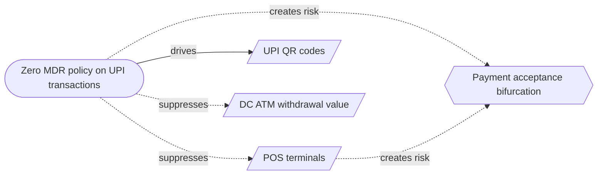

# The deep read — May 2026

This month's question: Payment acceptance bifurcation: POS contracting while UPI grows — how real is this risk?

The monthly issue covered what moved. This one takes a question that has been building across the credit and payments data and follows it down — with the model's own computed basis, and a sourced why wherever one is verified. It ends with the banks: who is gaining ground, and who is drifting from their peers.

## Why this question now

POS terminal network contraction while UPI QR expands creates an acceptance gap: merchants who drop POS terminals cannot accept international cards, EMI transactions, premium credit card features, or POS-authenticated payments. Customers without UPI-linked accounts face reduced options at merchants who have switched fully to UPI.

*Every box and arrow here is from the causal model — a solid arrow pushes the same way, a dashed one pushes against.*

The reason is a policy one: Zero MDR policy on UPI transactions. It pushes two ways at once — it lifts UPI QR codes and it weighs on POS terminals. It is on the record — Union Budget 2022-23.

You can see both sides in the data — the same force, pushing them opposite ways:

UPI QR codes grew 16.4% over the past year.

POS terminals shrank over the past year, its rate at -0.5%.

What it means for a lender, plainly: the two sides are drifting apart, and whatever only the shrinking side provided drifts out of reach for those who follow the growing one. That gap is the read as it stands today.

On the official record — Ministry of Finance / Press Information Bureau — 'Advancing Cashless India': “Since January 2020, to promote digital transactions, MDR has been made zero for RuPay Debit Card and BHIM-UPI transactions” (official/regulatory, https://www.pib.gov.in/PressReleasePage.aspx?PRID=2114335&reg=48&lang=2)

Others are seeing it too — Business Standard — 'Doing away with charge levied on merchants may hurt PoS machines deployment': “the move to do away with the merchant discount rate (MDR) in the Union Budget” (financial press, https://www.business-standard.com/article/finance/doing-away-with-charge-levied-on-merchants-may-hurt-pos-machines-deployment-119073001662_1.html)

### Bank angle

We don't yet publish a sourced, bank-by-bank why for this question — a bank-level reason appears here only once it is found, quoted, and verified against a public source. Until then, the computed read above and the bank movements in “Banks this month” below are what we can stand behind.

---

## Banks this month

This part is fully computed — who is gaining ground on their peers, and who is pulling away from their own category. No editorial pick beyond which banks to show.

### Who's rotating

In credit cards, Small Finance Banks gained the most share (0.7pp) while Foreign Banks gave up the most (0.5pp).

In debit cards, Private Sector Banks gained the most share (0.5pp) while Payment Banks gave up the most (1.3pp).

In POS terminals, Public Sector Banks gained the most share (1.9pp) while Private Sector Banks gave up the most (1.8pp).

### Who's diverging

Banks whose own growth pulled furthest away from their category's — ahead of it, or behind it (year-on-year).

| Credit cards | vs its category (pp) |  |
| --- | --- | --- |
| SBM Bank India | 24.7pp | ▲ ahead of its group |
| Citi Bank | 20.6pp | ▲ ahead of its group |
| HSBC | 11.3pp | ▲ ahead of its group |
| South Indian Bank | -18.0pp | ▼ behind its group |
| Dhanalaxmi Bank | -23.8pp | ▼ behind its group |
| Tamilnad Mercantile Bank | -45.8pp | ▼ behind its group |

> 📊 **[CHART — replace with screenshot]** indiacreditlens.com/payments → Credit cards → per-bank YoY view → highlight: SBM Bank India, Citi Bank, HSBC, South Indian Bank, Dhanalaxmi Bank, Tamilnad Mercantile Bank

| Debit cards | vs its category (pp) |  |
| --- | --- | --- |
| NSDL Payments Bank | 412.5pp | ▲ ahead of its group |
| Jio Payments Bank | 122.3pp | ▲ ahead of its group |
| Airtel Payments Bank | 92.2pp | ▲ ahead of its group |
| Equitas Small Finance Bank | -37.1pp | ▼ behind its group |
| Utkarsh Small Finance Bank | -41.9pp | ▼ behind its group |
| Nainital Bank | -53.0pp | ▼ behind its group |

> 📊 **[CHART — replace with screenshot]** indiacreditlens.com/payments → Debit cards → per-bank YoY view → highlight: NSDL Payments Bank, Jio Payments Bank, Airtel Payments Bank, Equitas Small Finance Bank, Utkarsh Small Finance Bank, Nainital Bank

| POS terminals | vs its category (pp) |  |
| --- | --- | --- |
| Karur Vysya Bank | 410.6pp | ▲ ahead of its group |
| Federal Bank | 23.7pp | ▲ ahead of its group |
| YES Bank | 18.4pp | ▲ ahead of its group |
| Central Bank Of India | -19.1pp | ▼ behind its group |
| Union Bank Of India | -36.3pp | ▼ behind its group |
| UCO Bank | -68.5pp | ▼ behind its group |

> 📊 **[CHART — replace with screenshot]** indiacreditlens.com/payments → POS terminals → per-bank YoY view → highlight: Karur Vysya Bank, Federal Bank, YES Bank, Central Bank Of India, Union Bank Of India, UCO Bank

## What we're watching

Pair divergence — ATM fleet vs cash withdrawn from it (YoY gap, pp) is 3.3 pp and reads accelerating. A fall to 3.0 pp would change that reading to steady — a move of 0.3 pp, against a typical monthly move of 2.5 pp.

---

Every read here updates automatically when new RBI data lands. The live version, with charts and the full computed basis, is here: https://indiacreditlens.com/opportunities

*How this is made: Part A is computed straight from the bank data. The spine is chosen by an editor from a ranked shortlist the pipeline builds, then answered with the model's computed basis. A bank-level 'why' or an outside corroborating source appears only once it has been found, quoted, and verified with a link — never inferred. Until then, the computed basis is the read.*
