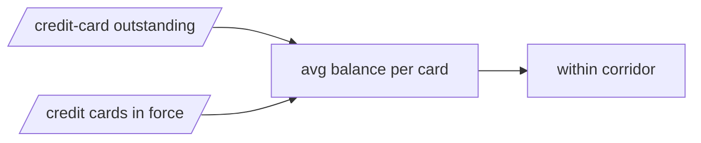

# The deep read — June 2026

This month's question: Average balance per credit card (plausibility corridor) — stretched, or normal?

The monthly issue covered what moved. This one takes a question that has been building across the credit and payments data and follows it down — with the model's own computed basis, and a sourced why wherever one is verified. It ends with the banks: who is gaining ground, and who is drifting from their peers.

## Why this question now

This is a cross-check, not a trend. Two independent RBI sources — one on the credit side, one on the payments side — are compared to see whether they still tell a consistent story. When they drift apart, it usually means a data problem to fix, not a real economic move.

*Every box and arrow here is from the causal model — a solid arrow pushes the same way, a dashed one pushes against.*

What it means, plainly: this is a data check, not a market move. As long as the two sources reconcile, the numbers downstream can be trusted; when they don't, it is a source to fix.

### Bank angle

HDFC Bank — HDFC is the largest card issuer and held up better than peers as spends cooled, nudging its share of the concentrated market higher. “supported by a relatively softer decline in spends” (financial press: https://www.business-standard.com/finance/personal-finance/ticket-size-squeeze-average-spend-per-credit-card-falls-13-to-17-060-yoy-126022600164_1.html)

SBI — SBI Card, one of the dominant issuers, ceded ground this cycle as its card spends fell fastest among the leaders, yet stays in the top tier. “The top four banks (HDFC Bank, SBI, ICICI Bank, and Axis Bank) continued to dominate” (financial press: https://www.business-standard.com/finance/personal-finance/ticket-size-squeeze-average-spend-per-credit-card-falls-13-to-17-060-yoy-126022600164_1.html)

ICICI Bank — ICICI slipped within the concentrated leading pack as its card spends declined. “The top four banks (HDFC Bank, SBI, ICICI Bank, and Axis Bank) continued to dominate” (financial press: https://www.business-standard.com/finance/personal-finance/ticket-size-squeeze-average-spend-per-credit-card-falls-13-to-17-060-yoy-126022600164_1.html)

Axis Bank — Axis remains one of the dominant issuers in a highly concentrated credit-card market. “The top four banks (HDFC Bank, SBI, ICICI Bank, and Axis Bank) continued to dominate” (financial press: https://www.business-standard.com/finance/personal-finance/ticket-size-squeeze-average-spend-per-credit-card-falls-13-to-17-060-yoy-126022600164_1.html)

---

## Banks this month

This part is fully computed — who is gaining ground on their peers, and who is pulling away from their own category. No editorial pick beyond which banks to show.

### Who's rotating

In credit cards, Small Finance Banks gained the most share (0.8pp) while Foreign Banks gave up the most (0.6pp).

In debit cards, Small Finance Banks gained the most share (0.6pp) while Payment Banks gave up the most (1.4pp).

In POS terminals, Public Sector Banks gained the most share (4.5pp) while Private Sector Banks gave up the most (4.5pp).

### Who's diverging

Banks whose own growth pulled furthest away from their category's — ahead of it, or behind it (year-on-year).

| Credit cards | vs its category (pp) |  |
| --- | --- | --- |
| SBM Bank India | 23.5pp | ▲ ahead of its group |
| Citi Bank | 21.2pp | ▲ ahead of its group |
| HSBC | 9.4pp | ▲ ahead of its group |
| South Indian Bank | -19.3pp | ▼ behind its group |
| Dhanalaxmi Bank | -24.0pp | ▼ behind its group |
| Tamilnad Mercantile Bank | -44.1pp | ▼ behind its group |

> 📊 **[CHART — replace with screenshot]** indiacreditlens.com/payments → Credit cards → per-bank YoY view → highlight: SBM Bank India, Citi Bank, HSBC, South Indian Bank, Dhanalaxmi Bank, Tamilnad Mercantile Bank

| Debit cards | vs its category (pp) |  |
| --- | --- | --- |
| NSDL Payments Bank | 366.8pp | ▲ ahead of its group |
| Jio Payments Bank | 92.5pp | ▲ ahead of its group |
| Airtel Payments Bank | 90.9pp | ▲ ahead of its group |
| Equitas Small Finance Bank | -41.1pp | ▼ behind its group |
| Utkarsh Small Finance Bank | -47.4pp | ▼ behind its group |
| Nainital Bank | -52.3pp | ▼ behind its group |

> 📊 **[CHART — replace with screenshot]** indiacreditlens.com/payments → Debit cards → per-bank YoY view → highlight: NSDL Payments Bank, Jio Payments Bank, Airtel Payments Bank, Equitas Small Finance Bank, Utkarsh Small Finance Bank, Nainital Bank

| POS terminals | vs its category (pp) |  |
| --- | --- | --- |
| Karur Vysya Bank | 484.3pp | ▲ ahead of its group |
| YES Bank | 105.2pp | ▲ ahead of its group |
| Federal Bank | 44.2pp | ▲ ahead of its group |
| Central Bank Of India | -14.5pp | ▼ behind its group |
| Union Bank Of India | -31.0pp | ▼ behind its group |
| UCO Bank | -69.8pp | ▼ behind its group |

> 📊 **[CHART — replace with screenshot]** indiacreditlens.com/payments → POS terminals → per-bank YoY view → highlight: Karur Vysya Bank, YES Bank, Federal Bank, Central Bank Of India, Union Bank Of India, UCO Bank

## What we're watching

Pair divergence — debit cards issued vs spent on (YoY gap, pp) is 3.3 pp and reads accelerating. A fall to 3.0 pp would change that reading to steady — a move of 0.3 pp, against a typical monthly move of 2.5 pp.

---

Every read here updates automatically when new RBI data lands. The live version, with charts and the full computed basis, is here: https://indiacreditlens.com/opportunities

*How this is made: Part A is computed straight from the bank data. The spine is chosen by an editor from a ranked shortlist the pipeline builds, then answered with the model's computed basis. A bank-level 'why' or an outside corroborating source appears only once it has been found, quoted, and verified with a link — never inferred. Until then, the computed basis is the read.*
